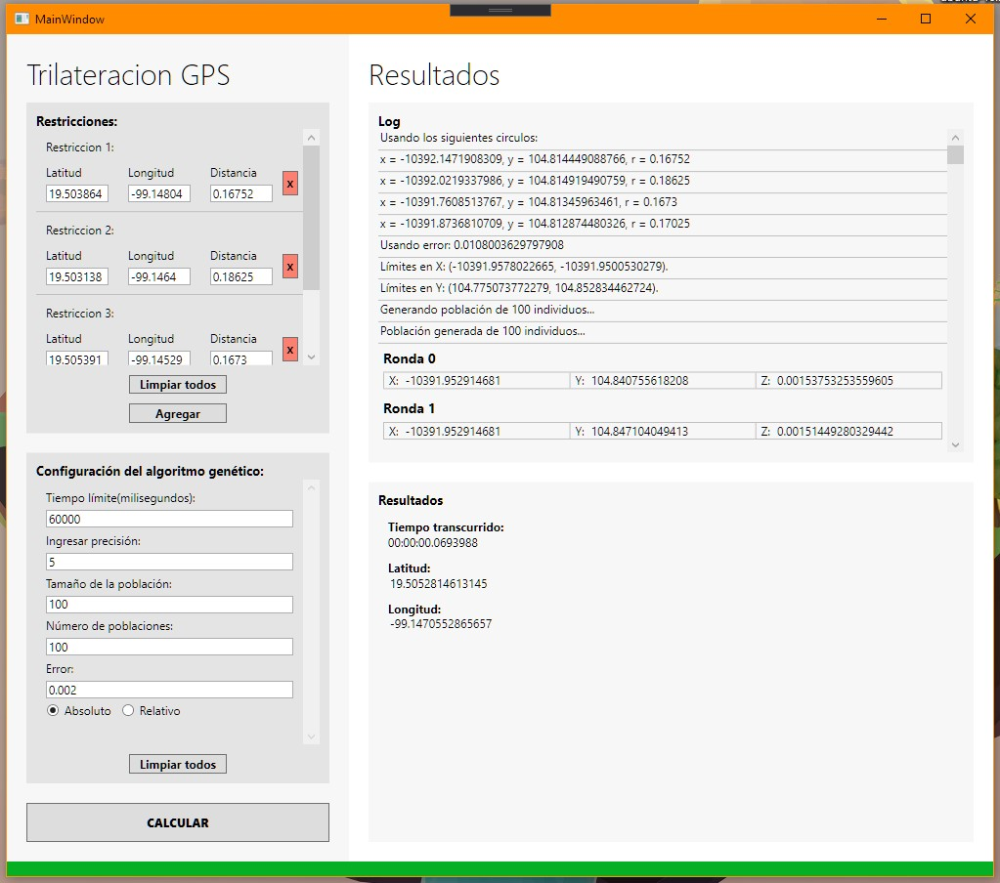

# Proyecto Trilateracion GPS
Repo en desarrollo
# Changelog
## Versión 1.0.0_prev
### 20 de mayo de 2020
### Características
- Acepta `n` referencias globales.
- Convierte coordenadas GPS a cartesianas.
- Implementación de hilos en segundo plano para que la interfaz no se bloqueé y sea responsiva. :fire:
- Log que se actualiza directamente del hilo en segundo plano.
- Permite cancelar el proceso, además de implementar un timer :watch:
### Bugs :bug:
- Tal vez el algoritmo genético no esté minimizando Z de forma correcta (En revision...)

# Interfaz

En desarrollo...